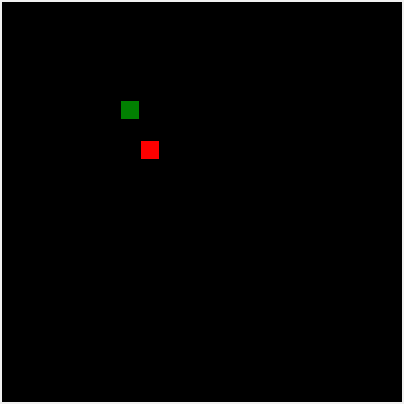

# Deep Q Learning

## Introduction

This directory contains code for a Snake Game AI that utilizes an algorithm in Deep Reinforcement Learning known as Deep Q Learning. 

## Description
This algorithm trains the AI by providing it with either a reward or penalty depending on its action. Overtime, the AI will be able to learn the actions that it should perform in order to obtain the highest reward.

The snake runs on a neural network with 14 input units, 3 hidden layers with 30 units, and an output layer with 3 units.

The input layer consists of:
* Distance of snake to the wall boundaries (Left, Front, Right)
* Distance of snake to its tail (Left, Front, Right)
* Direction the snake is facing (Up, Down, Left, Right)
* Distance from food to snake (Up, Down, Left, Right)

The output layer consists of the following possible actions the snake can take:
* Move left
* Move front
* Move right
  
## Running Instructions
You can train the snake AI model by running `main.py`.

Performance of pretrained models can be viewed by running `plotEpisodeToScoreGraph.py`.

By default, the Snake game GUI will not be shown. The boolean `SHOW_GUI` in both of this file can be changed to `True` to display GUI.

## Results
I have trained the AI for 400 episodes,  with the average score of 10 games for every 10 episodes of the AI compiled in the following graph. 

