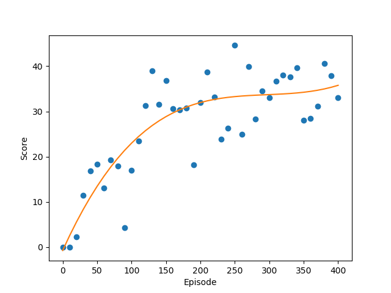

# Deep Q Learning

## Introduction

This directory contains code for a Snake Game AI that utilises an algorithm in Deep Reinforcement Learning known as Deep Q Learning. 

## Description
This algorithm trains the AI by providing it with either a reward or penalty depending on its action. Overtime, the AI will be able to learn the actions that it should perform in order to obtain the highest reward.

## Results
I have trained the AI for 400 episodes, with the performance of it compiled in the following graph. 

It can be seen that the performance of the AI steadily increases over the episode, but it appears to stagnant after reaching a score of 40-50.

