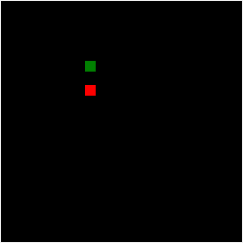
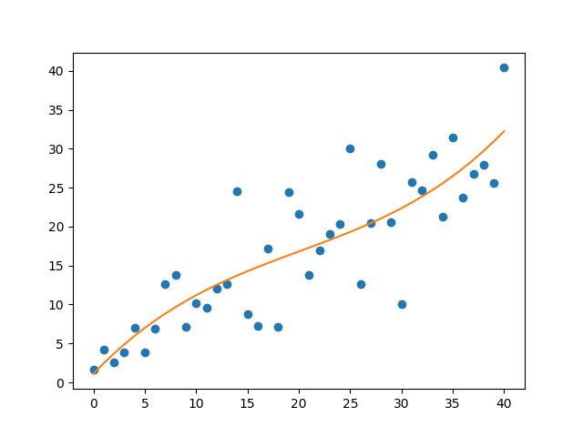

# Genetic Algorithm

## Introduction

This directory contains code for a Snake Game AI that is trained using Genetic Algorithm 

## Description
This algorithm trains the AI by simulating natural selection. The population for the first generation was generated at random, and the later generations will then be produced by crossbreeding the top performing snakes from the previous generation. 

The snakes chosen to crossbreed are selected based on their fitness function, with a higher fitness meaning that they have a higher chance to be selected as a parent. 

The snake runs on a neural network with 14 input units, 3 hidden layer with 30 units, and an output layer with 3 units.

The input layer consist of:
* Distance of snake to the wall boundaries (Left, Front, Right)
* Distance of snake to its tail (Left, Front, Right)
* Direction the snake is facing (Up, Down, Left, Right)
* Distance from food to snake (Up, Down, Left, Right)

The output layer consist of the following possible actions the snake can take:
* Move left
* Move front
* Move right
* 
## Results
I have trained the AI for 40 generations, with the performance of it compiled in the following graph. 

