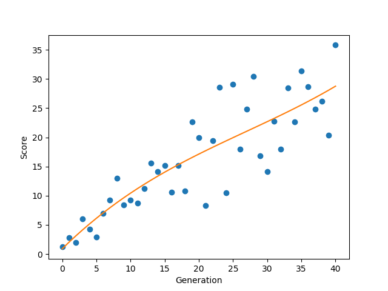

# Genetic Algorithm

## Introduction

This directory contains code for a Snake Game AI that is trained using Genetic Algorithm 

## Description
This algorithm trains the AI by simulating natural selection. The population for the first generation was generated at random, and the later generations will then be produced by crossbreeding the top performing snakes from the previous generation. 

The snakes chosen to crossbreed are selected based on their fitness function, with a higher fitness meaning that they have a higher chance to be selected as a parent. 

## Results
I have trained the AI for 40 generations, with the performance of it compiled in the following graph. 

It can be seen that the performance of the AI steadily increases over the generations. It appears that the performance of the snakes can still be improved given more training time. 

